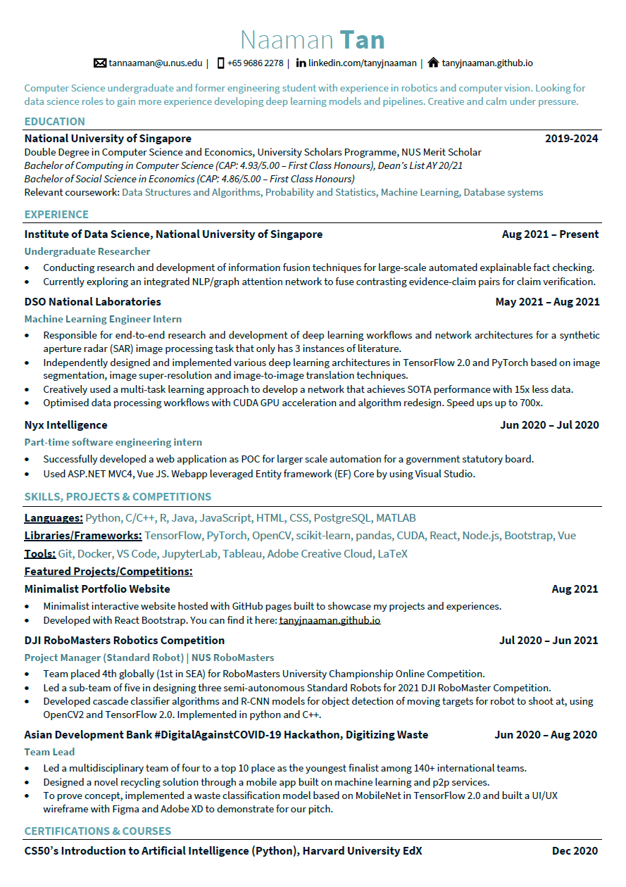
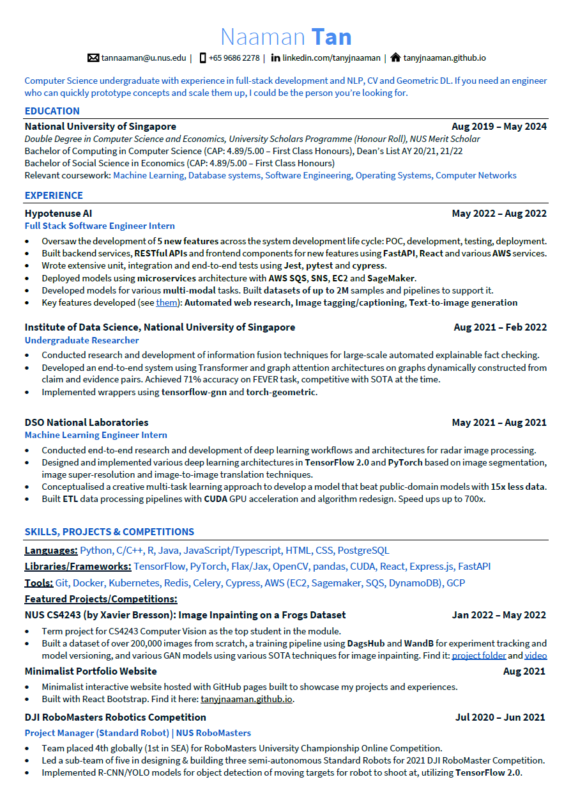
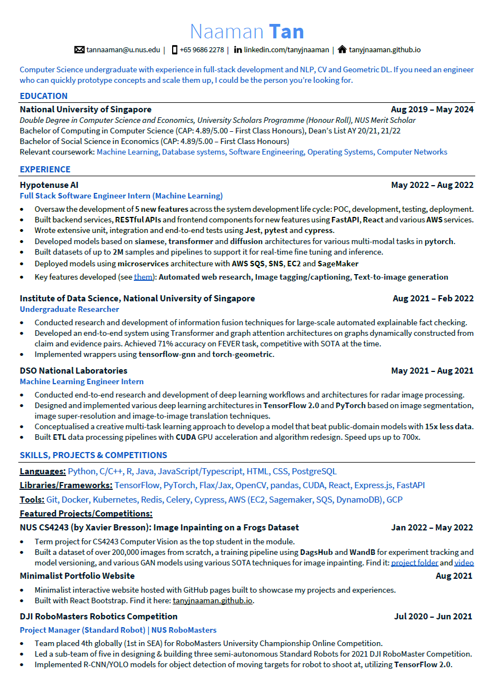
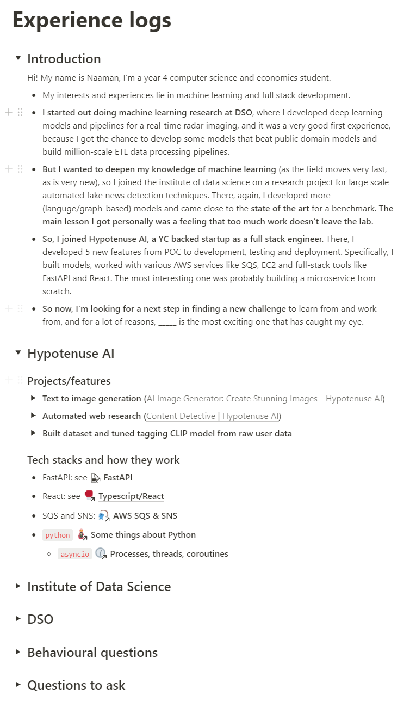

I came into Computer Science in the middle of year 2 - I had changed my course from mechanical engineering, mostly because I realized I really liked machine learning. But finding jobs haven't been easy, and I figured I'd share some of the wonderful resources I've compiled and little lessons I, too, have learnt.

Thanks to Kenneth's [great blog post](https://luyangkenneth.github.io/evolution-of-resumes/) I learnt how to write my first few resumes, but at the risk of creating slightly duplicated content, I think I have some additional anecdotal experiences to share.

For context: my CS journey started in Y2S2, after changing my course of study. My first internship was _very_ lucky, as I got it through sheer luck via TalentConnect - I interned as an ML engineer at DSO. My second was at a startup called Hypotenuse AI. My third and fourth, both offered at the same time, was at Palantir and Apple respectively. Hope this helps someone.

## Year 2, Semester 2 (2021)

In my own records, I applied to a grand total of 28 different places, with a mix of mechanical engineer, data analytics, UI/UX and ML engineer roles. My background at this point was of a robotics engineer and 0 CS background - I had literally just changed my course of study and not taken a single course. I got 2 offers - a startup called Cognicept, and DSO.

**What I tried to do with my resume:**

- Follow the general advice and resources compiled in Kenneth's blog post, linked above. Read that first!
- In particular: focus on formatting for easy reading + automated resume screening, generally remove irrelevant work I did.

**Some good things going for me:**

- My resume was not empty, as I had done some robotics projects and helped a friend out with some software stuff.

**General mistakes I made:**

- Wrote a unique resume and cover letter for every application. Cover letters don't matter, and there "tailoring" a resume by and large wastes time without much benefit.
- Started applying only in February. Everything interesting was gone.
- Did 0 leetcode. To be fair, I was basically an engineering student and had no idea.

**What I did moving forward:**

- Did not bother with cover letters. They take _way_ too long for virtually zero benefit.
- Grind leetcode with feedback. In particular, I find [Neetcode](https://neetcode.io/practice) to be an excellent free resource.

## Year 3, Semester 1 & 2 (2021-2022)

Having now gone from 0-1, I felt a little better. My aim for this application cycle was on startups. The main reason was the belief that a (good) startup would grow me more as a budding engineer. In this application cycle, I made about 68 applications according to my records - but it's probably more, seeing as I stopped logging them after a while. I iterated through 2 resume versions.

I got a total of 3 offers - World Quant, Hypotenuse AI and Affable AI, and took the one at Hypotenuse AI. Their interviews were _by far_ the hardest - it was 3 hours of non-stop grilling. Convinced me that they knew what they were doing and there was high learning value in joining them.

**What I tried to do:**

- I made a website/linkedin and added links to them.
- I added a quick summary. I doubt it would work, but also figured it wouldn't be a bad thing to do.
- I added colour for quicker readability/highlight what I thought might be important.
- I added more concrete descriptors (e.g. improve performance by 700x)
- After asking some seniors who did hiring, added a small section on the tech stacks I'd worked with (or figured I could learn fast enough for an interview).
- Removed my JC from my education, since I didn't need the "filler" anymore.
- Added a project that was my website as a showcase that I could do _some_ frontend dev. I'm still shit at it.

**Feedback I got from friends/interviews and mistakes I made:**

- Resume looked a bit haphazard. Colour was nice, but could be hard to read. Uneven spacing/line lengths made it hard to read. Too much content in general.
- Did not do enough leetcode still, was struggling with hackerranks at medium. Honestly spent too much time chilling/studying for mods.
- Did not apply widely enough. Focused almost entirely on "high success" applications as I was afraid of rejection (e.g. did not apply for FAANG, Indeed & similar tech firms, or banks/finance).
- Courses don't matter for CS kids.
- Make sure links in resume aren't broken - one of my interviewers tried to see my stuff, but couldn't.
- Make sure you can be _grilled_ for everything you have on the resume. One of my interviews did a _deep, deep_ dive, and I couldn't explain some of the work I did/some of the tech stacks (but generally did ok!).

**Some observations:**

- Generally got past resume screen for ML/DS related roles. At those points, generally did well because algos would only be one part of it. A big part of ML/DS interviews are theory heavy, and those require a different type of preparation. Checkout [Chip Huyen's](https://huyenchip.com/ml-interviews-book/) and [Rishahb's](https://rish16.notion.site/Machine-Learning-Bites-7c1675ecb587451e9caf793c68972276) excellent resources for those.
- Barely got past resume screen for any SWE roles. Which made sense, given I had basically zero SWE dev experience.

## Year 4, Semester 1 (2022-2023)

Generally, I was quite happy with this application cycle, though it wasn't easy. I applied to a total of 112 companies according to my Notion, and according to my learnings from my previous cycles, literally applied for _everything_ that looked interesting to me. These included banks, FAANG, other tech firms, startups, anything and everything.

The sheer number of interviews I did helped to keep me warm, as did the leetcode, but it also really told me about the types of companies I really didn't like. Just as much as an interview is about them evaluating you, you are also evaluating them. Moving forward, I'm pretty sure finance firms/banks ain't it for me. I really didn't like GS's or JPM's (and a few others) hiring styles. But startups and big tech are still pretty cool, except for some (ahem ByteDance).

I got a total of 5 offers - Apple, Palantir, Worldquant, Munich Re, AMD. I've accepted Palantir and Apple.

Something I noticed was that for some reason somehow this year's replies/rejections/advancement to next round seemed super slow. As I write this in January, I've gotten about 5 emails telling me I've passed the resume screen - despite applying in October or so.

That said, I've also gotten a _ton_ of rejections this year, and for many parts in this cycle I was pretty demoralized. I stopped counting when the rejections hit 40 or so, lol. I guess more applications also means more rejections, because my rejection rate is probably lower than it was in previous years.

**What I tried to do:**

- Grind leetcode hard. Previously, I did leetcode only to warm up for interviews. This time, for the first 6 weeks of semester 1, I did 2-3 medium/hards a day. After, I would do 2-3 medium/hards every 2-3 days. Every time it would be timed, and every time I would do it as if I was in an interview. It was exhausting.
- Record my leetcode progress. I kept my leetcode solutions on Notion, tracking how I solved them, the topic, their difficulty, and how much time I took to solve them. This helped to create a bank of solutions and also let me visualize how I was progressing.
- Make my resume more concise, and make one for DS/ML roles, and one for SWE roles - their stacks and skillsets are different. For SWE, the focus was more on typical stuff - tech stacks, the product life cycle, etc. For DS, was mostly about the techniques for model development and applications.
- Prepare a "summary" of myself on Notion explaining my resume Things like how I chose each experience and the key experiences for each. It would help _a lot_ for resume deep dives and HireVues.

**What went well:**

- Leetcode grind made a huge difference. I was generally 100%-ing most hackkeranks - except for Bytedance and Google's OA.
- Summary of myself made my life much easier for interview prep.

**What I could have done better/feedback I got:**

- Resume is still quite cluttered and hard to read. At least 2 interviewers appeared to be reading my resume for the first time during the interview and seemed to struggle to digest all the information.
- Was told by a friend doing hiring that summaries don't usually matter to HR or the hiring manager, and instead they look for experiences/familiarity with a certain tech stack they are looking for/general evidence for the character/skills they are looking for.
- Prepared better for theory questions (e.g. explain how the DOM works, how React works, what is RESTful APIs, etc.)
- Apply for the one you _really_ want only when you're sorta warmed up - Stripe was my first interview, and I flunked it,

## What it looks like now

I've since revamped my format a little. In particular:

- Removed the summary.
- Separated skills and projects into separate sections, as hiring managers seem to like to look at tech stacks and langauges and then test you specific parts of those stacks/languages. This might make it easier for them to read.
- Generally prettified it with a more readable font.
- Removed custom formatting that I forced via drag-and-drop - that might have been screwing with automated resume screening tools.

## Some personal thoughts

#### 1. I am not that good at algo questions, but god, `leetcode` really helps

I flunked the Google OA and Bytedance's one I found really hard. Apart from that, regular leetcode was really helpful. Beyond that though, I started to find myself enjoying doing them daily/every other day. It was like a fun getaway where I could plug in my headphones and just do some dumb coding. Was fun.

#### 2. Prepping for content is helpful

Bytedance grilled me with theory questions I was not prepared for. I will prepare for this going forward. I took CS3219 this semester, though, and it was very helpful to have that bank of knowledge in addition to my own experiences when facing tricky real-world-like interview questions, especially in system design ([this](https://designgurus.org/course/grokking-the-system-design-interview) is a pretty good course).

#### 3. Cast the net wide

Consider:

- 2020: 2/28 offers (7.2%), 3/28 (10.7%) got past resume screen.
- 2021: 3/68 offers (4.4%), 7/68 (10.3%) got past resume screen.
- 2022: 5/112 offers (4.5%), 12/112 (10.7%) got past resume screen.

Maybe this year is skewed since we're only in January and I'm stopping the count, but still, looking at these numbers and their stable proportions, I can't help but wonder if it truly is a numbers game. We're also in a strange time of hiring freezes this and last year, so perhaps that's also affected what I would have expected to be generally growing proportions of success.

In either case, I will take these insights to cast my net wide and far - apply more, and you'll probably get more chances.
