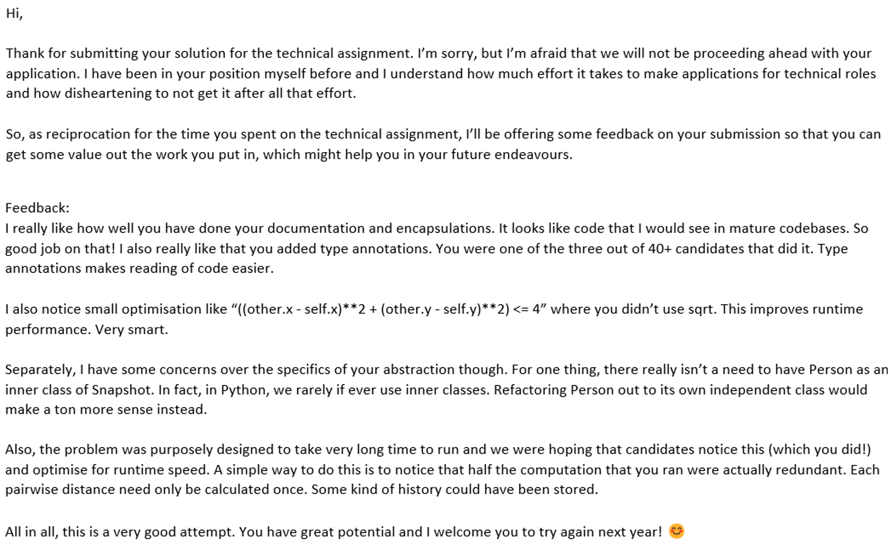

I think it's not hard to find plenty of good resources on building your career in tech - Kenneth's [very famous blog post](https://luyangkenneth.github.io/evolution-of-resumes/), for example, is one of the most popular ones. For a while now, my journey in university and tech has been a bit unconventional, and I'd just like to put it out there - just to provide my nothing-special-about-it perspective and maybe that helps to ground someone else's experiences. In some ways, [this post](https://haushofer.ne.su.se/Johannes_Haushofer_CV_of_Failures.pdf) is kinda what I'm going for - just some perspective, and maybe it'll entertain someone.

The TL;DR of this blog post is really just me going through the challenges I faced in my job hunt, some things that I think worked, some that I think didn't. I'll go through it chronologically, so it's hopefully something of a helpful basis for comparison for someone in a similar stage of their development. Like Kenneth, I intend to share my resumes, and I think I'll also link to some helpful resources I found along the way, but the focus is really just documenting a journey in a bite-size way to hopefully help someone contextualize their own experiences. It's a N=1 sample of one's journey in tech.

### Year 1, 1.5: I changed my major (2019-2020)

* I was lost because my major did not feel right in Y1 and Y2 - I hated it, and was kinda miserable
* I spent most of my time doing a bunch of projects (e.g. competitions) hoping that one of them would stick and help me figure out what I liked
* It was really hard
* At the advice of some teachers I bit the bullet and changed my major

My journey in Computer Science has been unconventional. I entered university studying mechanical engineering, and I really did not enjoy a lot of it. Hated it, really. But I kinda knew that something didn't feel right even before coming into university, so really, a lot of my first year to  year-and-a-half was spent on doing as many things as widely and broadly as possible - case competitions, engineering projects, book clubs, whatever. 

Honestly, I had no idea what I was doing, it was really just exploring and praying that "things will work out eventually". As a result, I never even considered interning in the summer of year 1. Some of my friends did, but I was so far away from knowing what I wanted to do that I didn't even feel underqualified - I just felt lost. I was stressed all the time about it, and often times felt as if "maybe I can just roll with it". I never did, though, because it never sat right with me to study something I hated.

So, for those of you who're not sure about what you're studying, please, take my advice on this - figure it out, and figure it out early. It is more important than anything else you can do right now, because it gets a lot harder the further and deeper you go. If you're in year 1 and 2, or about to enter university, spend as much time as you can on opportunities *that give you more information.* 
* Do things that are orthorganal to one another, do not repeat - that gives you the most information about what you like in the least time! They are a waste of time, and 2 competition wins do not look significantly nicer than 1. 
* Spend a lot of time talking to people about what they're doing *and why they did it.*
* If you're faced with a big choice (e.g. changing your major), get a young adult's perspective - they are close enough to our age, but far enough along in life that they can better weigh whether your anxieties are short sighted. A teacher of mine once reminded me that changing your career is 100x harder when you're 32 than when you're 22, and that was enough to convince me to change my major. 

Inspired by some robotics projects and nudging by trusted adults, I changed my major, and started studying CS in Y2S2. Things felt right, finally, but I was about to enter the ever-anxiety-inducing and infamous CS internship grind. 

## Year 2: the internship grind begins (2021)

* CS wasn't easy, I felt dumb eternally, I kinda still do
* Kenneth's [blog post on resumes](https://luyangkenneth.github.io/evolution-of-resumes/) got me started on resume writing, do check it out because it's pretty helpful
* Googling, LinkedIn and glassdoor for e.g. "Machine Learning Engineer" is kinda enough to find things to apply for
* I mass-applied for internships despite being desperately unqualified; I didn't even do leetcode (don't do this)
* Started applying only in February (don't do this either, most interesting things are sadly, gone)
* I passed 4/28 resume screens, got 2 offers despite failing some interviews spectacularly
* Don't waste your time like I did writing cover letters, it literally makes no difference

Now, I think the "usual thing" to do is to have an internship in year 2 summer, year 3 summer, and then graduate into a job that you hopefully don't hate. I was now approaching the summer of year 2, so I had to get started. But boy oh boy was I lost. How do I write a resume? Where do I find jobs? How do I pass an interview? How do I organize my applications? Where do I start? I had these questions, and considering how many blogs write about them, I doubt I'm the only one to have thought these things. 

My background at this point was of a robotics engineer and 0 CS background - I had literally just changed my course of study, after all. While applying, I was taking CS2030S (an OOP class), CS1231S (discrete structures) and CS2100 (computer organization) - I barely knew anything about computing. 

But I eventually figured doing *something* even if sub-optimally was better than doing nothing, so I just got started. In my own records, I applied to a grand total of 28 different places, largely finding them through google, linkedIn, glassdoor, for a mix of mechanical engineer, data analytics, UI/UX and ML engineer roles. I also wasted a ton of time writing cover letters, mistakenly believing it made some sort of difference - they don't, at least, not really. Here's my resume at the time, for reference:

Overall, I believe only 4 got back to me, and I got 2 offers. One of the failed applications though, I remember really clearly, because they were really kind about me failing what is (now) a very easy programming problem. 

I am eternally grateful to have somehow gotten an offer from DSO to do machine learning research on radar imaging systems. I learnt a lot and honestly met some really awesome people, but I don't for a second think that I got it because I'm good - I was lucky, and I think about that very often because it grounds me.

## Year 2 summer: my first internship at DSO and being largely lost

* DSO wasn't particularly nurturing, and I was put in a position where I had not much relevant skills nor support 
* I struggled, made a ton of mistakes, but delivered in the end
* It sucked, but I'm grateful for being in the position to learn stuff - it could have been worse

In short, working at DSO wasn't terrible, but also wasn't great. For one, I was brought in to do research on machine learning for *radar image processing* - I had 0 background in signal processing or the relevant physics. I spent most days self-studying the math behind signal processing, reading a ton of papers on computer vision models and techniques, and banging my head wondering why my simulation pipeline had a bug in it - because it could come from my lack of understanding the physics, the fact that I was using parallel computation for the pipeline (which, again I learnt by literally reading the CUDA handbook), or just a careless mistake. The frustrating bit was that it was often the former two cases, and I sadly did not have as much support or guidance as I would have liked. Building the models were similarly challenging. 

But from a larger perspective, I think working in that kind of low-support environment really is just a trial-by-fire - it sucked and honestly beat a lot at my self confidence. And plus, I made a lot of mistakes. But it also helps to know that I didn't freeze and sink - I tried my best to learn as fast as I can, and built some working models and a simulation pipeline that to my knowledge is still in use today. 

At the end of my internship, I was exhausted - and I recently even found out from someone at DSO who spoke to my then-boss that I'm apparently not good at solving "open problems". I respectfully disagree, but I'm still grateful for having an internship at all at the time. They took a gamble on me, and I'm not sure either party was satisfied, but I learnt new things and had something to put on my resume, and for that alone I'm happy. Making the best of it, I guess.

## Year 3: startup copium (2021-2022)

* For some reason people tell you to apply as early as September, and god, that causes so much anxiety, but there's some truth to it
* I knew I wasn't good enough for super competitive positions - and I made peace with it by focusing on high-quality startups
* You can find a helpful set of startups with [SGInnovate's Summation program](https://stars.sginnovate.com/talentprogrammes)
* You can study for ML interviews from useful sources like [Chip Huyen's](https://huyenchip.com/ml-interviews-book/) and [Rishabh's](https://rish16.notion.site/Machine-Learning-Bites-7c1675ecb587451e9caf793c68972276) blogs, and generally ask for good advice on [project intern](https://t.me/projectintern)
* Managing applications & OAs with school is honestly not easy 
* I tried to do too much, doing research, applying for internships and 6 mods - it was hell - and I wish I didn't do it that way
* I buffed up my resume, did a ton of (but still, not enough) leetcode, and it helped 
* I made a website out of insecurity, but I genuinely doubt it makes a difference
* I got 3 offers, and chose the one that would give me the highest learning value

I don't know about you guys, but everyone told me to apply "early", as in, in like September the year before kinda early. To me, it was (and still is) crazy talk - why would you apply basically a year ahead?? But everyone did so, and I did, too. In hindsight, you don't need to get started _that_ early or be very stressed about it, but yeah, getting started early helps.

Except that I was still insecure, still really shit at programming, and honestly just didn't want to face another harsh round of rejections. Irrational feelings aside, though, I think it's fair for me feel like shit - I mean, in September, I was _taking_ CS2040S Data Structures and Algorithms, a super basic course in CS - and hadn't taken other stuff like CS2103 Software Engineering, CS2106 Operating Systems, etc. No matter how you slice it, I'm not particularly qualified.  

But I made peace with it (low key was inspired by [this TED talk about imposter syndrome](https://www.ted.com/talks/mike_cannon_brookes_how_you_can_use_impostor_syndrome_to_your_benefit?language=en)) by just admitting to myself that indeed, I'm not good enough - but I want to be one day, and the best way to start is to learn. So I just aimed to optimize for learning aggressively, and kinda just avoided conversations when people talked about how they got an offer from Stripe or FAANG or HRT or whatever. I was on my own journey, and that was going to be it. Applying for a ton of startups, research, a ton of leetcode, and studying hard, I had decided, were going to be how I was going to learn. 

I did a lot of (but honestly still not enough) leetcode - I'd practice maybe once a week. 

I asked around in [project intern](https://t.me/projectintern) for advice, resources and stuff to prepare for interviews, and generally got good stuff like [Chip Huyen's](https://huyenchip.com/ml-interviews-book/) and [Rishabh's](https://rish16.notion.site/Machine-Learning-Bites-7c1675ecb587451e9caf793c68972276) excellent resources on ML interviews. Being part of that group in itself can be stressful though, so you kinda gotta manage it.

I applied for a ton of startups. I was, however, very selective about them - I had heard all sorts of horror stories about them, so I was determined to pick one with strong founders (at least on paper) and that had green flags going for it (e.g. YC backed). I found [SGInnovate's Summation Program](https://stars.sginnovate.com/talentprogrammes) to be really helpful, and that ended up being how I got my offer and one of the best summer's I've had!

I took 6 mods at school. Why? I... don't know. I just wanted to study as fast as I could. It was really hard and often times very emotionally challenging to manage. 

I was also fortunate to get an opportunity to work with Dr. Wynne Hsu on some research for fake news reasoning and detection (more on this later, because entering research is a whole other space of imposter syndrome). 

I also buffed up my resume at the advice of some friends. Specifically, I: 

- I added links to my socials.
- I added a quick summary. I doubt it would work, but also figured it wouldn't be a bad thing to do.
- I added colour for quicker readability/highlight what I thought might be important.
- I added more concrete descriptors (e.g. improve performance by 700x)
- After asking some seniors who did hiring, added a small section on the tech stacks I'd worked with (or figured I could learn fast enough for an interview).
- Removed my JC from my education, since I didn't need the "filler" anymore.
- Added a project that was my website as a showcase that I could do _some_ frontend dev. I'm still shit at it.
  
Here's how it looked:

I also made a website out of some mistaken feeling that it would make me more appealing to recruiters. I doubt it did. But it was fun, I guess. 

In this application cycle, I made about 68 applications according to my records - but it's probably more, seeing as I stopped logging them after a while. I iterated through 2 resume versions. I got a total of 3 offers - World Quant, Hypotenuse AI and Affable AI, and took the one at Hypotenuse AI. Their interviews were _by far_ the hardest - it was 3 hours of non-stop grilling. Convinced me that they knew what they were doing and there was high learning value in joining them.

And as the semester and application cycle (and therefore, my struggles) came to an end, I had some reflections that I think are worth sharing.

**Being very selective about startups was a good idea**
I applied to quite a few - in the Summation Programme alone, I applied to AI Pallete, Affable AI, Polybee, Lauretta.io, Finantier and Hypotenuse AI. In many of these, and most of the startup interviews, I felt that they lacked rigour - questions were mostly non-technical in nature. The only ones that were different were Affable AI and Hypotenuse AI - they had challenging take home assignments and interesting technical and system design questions, and generally gave me the sense that they were talented people who knew what they were doing. This is important to me - and I think in general - because the opportunity cost of interning at a startup is not only the pay cut, but the learning opportunity from talented engineers/mentorship. In fast-moving organizations, interning without mentorship sucks.

**You don't need to apply that early for startups**
 I applied for startups in September. All of them asked why when I said it was for summer. A good number of them asked me to reapply in February, lol. I did. 

**Don't half-ass many things, whole-ass one thing**
I struggled so, so hard this semester. 6 mods, research, job applications... not conducive to mental health, personal relationships or your physical health. You also don't do things as well as you can, because you're stretched so thin. In fact, failing to really push on my research is one of the greatest regrets I have till this day. I'm not sure I could have done more, and there's always the "what if", but god, I wish I slowed down a little and didn't spread myself so thin. You live and you learn, I guess. 

**Make sure you can talk about everything on your resume**
This means literally making sure the links aren't broken, but also that you have enough familiarity to explain design choices, tech stacks, whatever. I really struggled in one of my interviews because I really struggled to put across why my project was hard and why my design choices made sense (the interviewer was very patient though, and thankfully so).

**Leetcode once a week is not enough (for me)**
I did medium/hards once a week. Did not see much improvement, and often struggled at mediums. To be fair, was also doing CS2040S during the application cycle, so it's kinda hard to do leetcode without knowing the theory. 

I also rewarded myself with a trip to Bali at the end of this gruelling semester. I'm glad I did, because I felt refreshed and recharged and it made a world of difference. 

## Year 3 summer: long hours but lots of learning at Hypotenuse

* Mentorship was excellent, I was given a ton of responsibilities, and I always felt valued and cared for
* I learnt so, so much, and built so many things - see [this](https://www.hypotenuse.ai/features/content-detective) and [this](https://www.hypotenuse.ai/ai-image-generator) :D
* I was offered a full-time role, but very sadly turned it down to go on exchange
* Probably the happiest 3 months I had in a long while, and I think I'd like to go back
* Working hours were rough and I often felt out of my depth (so many things built from scratch), though

High quality startups really are great places for learning. 

At Hypotenuse, my role was a mish-mash of full-stack and machine learning engineering responsibilities. I suppose as with most startups, I did a ton of stuff. But I think I was impressed by how well they had gotten the balance of structure and flexibility down - onboarding was excellent as were task allocations, I always felt valued and protected as an engineer with frequent one-on-one chats, I never felt like I couldn't ask questions or that I couldn't pitch difficult but workable solutions - it was all round just such a great and nurturing place to be. 

Granted, the hours were long - I averaged 9-10 most days, and we often joked that we saw each other more than our families. But it never once felt begrudging. I always felt like I was moving - I was learning a lot and very quickly, and it always felt like the team was moving. Pushing out new features, seeing our growth stats, pushing x, y and everything. It was addictive, and somehow it felt like I really thrived in that kind of dynamic and low-key chaotic environment. The people made it great too, because my fellow interns were funny and super-solid people, and the full-timers too. We still all keep in touch, in fact. 

That doesn't mean it was all flowers and rainbows, though - deadlines could be stressful, I often felt stuck and out of my depth (everything you build is basically built from scratch or working with code that was written quickly), and on occasion I would see my friends at FAANG or Indeed having a company-sponsored lunch with their standing desks and cushy in-town office wondering if that would have been nicer - comparison is the thief of joy, right? But these feelings were often fleeting and relatively insignificant in the bigger picture of what working here meant to me. 

All this to say, joining Hypotenuse has been one of the most fortunate decisions I've made, and if you, too, are considering joining a startup, maybe take a leap of faith if all the requisite green flags are there: 
* Founders with good track record (e.g. at Hypotenuse, they all had relevant experience)
* A product you genuinely think has value
* The interview process is smooth and you get the sense they know what they're doing during it (remember, you're interviewing them, too!)

It will be hard, but it might just be worth it.

## Year 4: surprising successes

* I applied a lot more bravely this time - everywhere, and anywhere
* I did a lot more leetcode and in a structured way, really thinking about how to solve things rather than doing it blindly
* I also studied SWE stuff, like [this](https://designgurus.org/course/grokking-the-system-design-interview)
* It sucked because I did this and applications alongside the infamous CS3203 Software Engineering Project and 2 TA roles 
* I got some early rejections that really deflated me (e.g. Stripe, GovTech)
* I realized I really don't like quant roles (e.g. at GS)
* This hiring cycle felt hard because many firms didn't (e.g. Indeed) and a lot of them got back to me months later

I came off the summer on some sort of a high - I felt like I'd grown a lot as an engineer, and felt ready to make a bigger step to Big Tech or working abroad. Even if I wasn't going to be there long term, I wanted to experience it. I had to make a tough choice to turn down a full-time offer at Hypotenuse, but I did, and back to school and the application grind. 

I was still stressed and insecure, but in a way that was different from the previous cycle. This time, I: 
* Did a lot more leetcode - we're looking at 2-3 medium/hards a day. I found things like [NeetCode](https://neetcode.io/) and logging my own progress/tips and tricks on a Notion page really helpful

* Applied widely and really dared to think bigger this time - FAANG (well, those that were open for applications), quant shops and US-based startups
* Found that SWE roles require a different set of prep compared to ML roles, and studied for them
* I also buffed up my resume a bit

Generally, I was quite happy with this application cycle. I applied to a total of 112 companies according to my Notion. The sheer number of interviews I did helped to keep me warm, as did the leetcode, but it also really told me about the types of companies I really didn't like. Just as much as an interview is about them evaluating you, you are also evaluating them. Moving forward, I'm pretty sure finance firms/banks ain't it for me. I really didn't like GS's or JPM's (and a few others) hiring styles. But startups and big tech are still pretty cool, except for some (ahem ByteDance). Also, something I noticed was that for some reason somehow this year's replies/rejections/advancement to next round seemed super slow. As I write this in January, I've gotten about 5 emails telling me I've passed the resume screen - despite applying in October or so.

I also got a _ton_ of rejections this year, and for many parts in this cycle I was pretty demoralized. I stopped counting when the rejections hit 40 or so, lol. The good 'ol "Thank you for your application" in the email subject stirs something in me to this day. I think I found being rejected by Stripe and GovTech to be particularly disappointing, and they really shook my confidence in myself. 

I was fortunate to receive a total of 5 offers - Apple, Palantir, Worldquant, Munich Re, AMD. I've accepted Palantir and Apple.

Gratefulness aside, reflecting on the things I did, I think here are some thoughts I think are worth sharing?

**I am not that good at algo questions, but god, `leetcode` really helps. Who knew?**

I flunked the Google OA and Bytedance's one I found really hard. Apart from that, regular leetcode was really helpful. Beyond that though, I started to find myself enjoying doing them daily/every other day. It was like a fun getaway where I could plug in my headphones and just do some dumb coding. Was fun.

**Cast the net wide, it's a numbers game?** 

Looking back on my past few years, I notice that the rates of passing the resume screen and offer rates are roughly consistent. 

- 2020: 2/28 offers (7.2%), 34/28 (14.3%) got past resume screen.
- 2021: 3/68 offers (4.4%), 7/68 (10.3%) got past resume screen.
- 2022: 5/112 offers (4.5%), 15/112 (13.9%) got past resume screen.

Maybe this year is skewed since we're only in January and I'm stopping the count, but still, looking at these numbers and their stable proportions, I can't help but wonder if it truly is a numbers game. We're also in a strange time of hiring freezes this and last year, so perhaps that's also affected what I would have expected to be generally growing proportions of success.

Somehow, I guess, this makes me feel better about all those rejections. 

**I still don't know what I'm doing, and I'm just trying to focus on being a better engineer**

I think I've come a long way since the start, and I think I have a clearer sense of what I want to do with my life after graduation (inside and outside of work), but I wouldn't say I know it with conviction. I just have a sense of it. I kinda doubt I'll ever not have doubts in my choices or feel supremely confident about everything - I don't think I'd want to either, because I'd probably be an insufferable asshole - so I think I'll go back to what I've been focusing on: learning and being a better engineer. It gives me a sense of groundedness and contentment - I mean, maybe I'll be a shit engineer, and maybe I won't go far, but I can tell myself I tried my best, and I think that's good enough. I think I'm in part inspired by [this wonderful blog post](https://lethain.com/forty-year-career/) and [this other one](https://nav.al/long-term), and I'd do no justice explaining it here - but the general idea is that I am optimizing for learning _rate_ because it just makes sense to me.

**Man, comparison really is the thief of joy**

One thing that I think occasionally comes up and I'd like to share my views on - is the stress of comparison. It's inevitable - I'm working my ass off doing leetcode, applying for 102847184 positions and doing their online assessments, and failing, but my friends (seemingly) easily get an offer from FAANG or Stripe or Indeed despite applying late. I know those are exaggerations, but it really got to me at times. I have no solution or panacea, other than to say "it be like that", and to have faith in yourself, grit your teeth, and find some solace in the fact that you're trying your best. The good 'ol "trust the process" and "try to be content", I guess. What I'm really trying to say is, it really just is what it is, and there's nothing you can do about how you feel about comparisons, so be kinder to yourself, and let the comparisons tell you what's out there, what's next, rather than "what you've failed to achieve". It's helped me cope, so maybe it'll help you, too. 

## TL;DR

I hope I achieved what I set out to do - provide an N=1 sample of how it feels like to go through the tech application cycle (and also, I guess, grow up?). I hoped you at least found it entertaining. Well, if nothing at all, it was like therapy for me, so that's good, I guess. 

I'm grateful for everyone who's helped me along the way, and I'd like to say for anyone of you guys out there - keep going! 

Maybe I'll look back on this one day with a palm on my face and in embarrassment. Anyway, for now, I'm headed to Zurich for exchange, and after that I'll fortunately be interning at Palantir in London. Exciting times! Imposter syndrome is sure to get me, but hey, let's hope I float.

