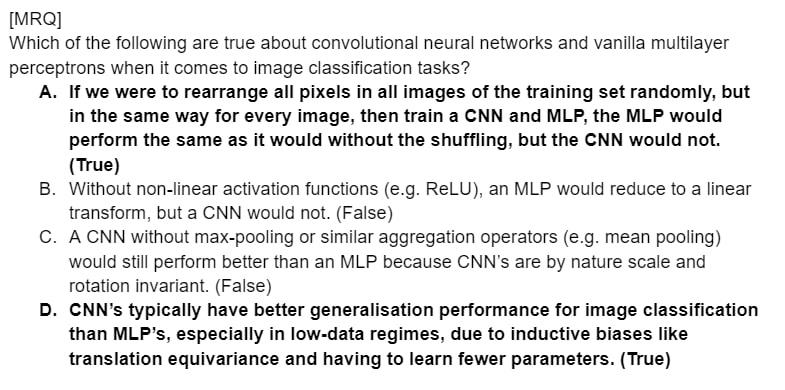
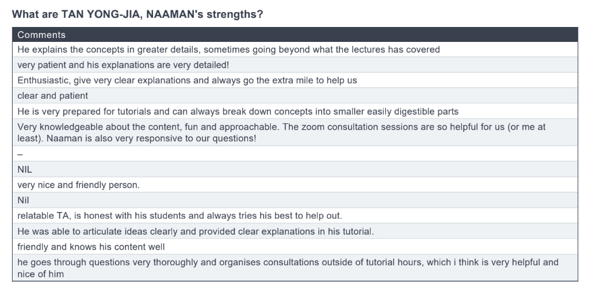
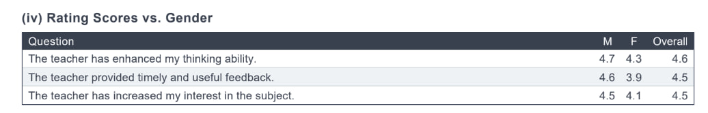

Last semester, I signed up to TA for CS2040 and CS3244. For those unfamiliar with those courses - CS2040 is a data structures and algorithms course for non-computing students, and CS3244 is a class on machine learning. The former is notorious for being challenging for non-computing students, while the latter has a reputation for being a little too touch-and-go in terms of how it teaches content.

I like classes on algorithms - I think they teach me very clever and often elegant ways of solving new problems I have often never seen, and in particular I think they simply expand the way I see things. I'm not very good at algorithms though - neither CS2040S nor later, CS3230 (Design and Analysis of Algorithms, a more advanced algorithms class) came easy to me. But I had the fortune of experiencing the teaching of some pretty good TAs, and wanted to pay it forward. This blog post in particular is inspired by one of those TAs - Christopher, the then head TA for CS3230. He was not my TA, but my TA was bad, and his sessions were recorded, and his classes helped me to get through the module. He wrote about his experience teaching [here](https://chrisjwelly.github.io/blog/2022/01/05/Career-Progression-CS3230-TA/), and I think it's worth checking out.

I also like machine learning. I mean, I used to study mechanical engineering, and it was my exposure to machine learning that convinced to change my course and throw myself into it. I think it's kinda incredible how some clever linear algebra and statistics can basically spit out magic. I've actually never taken CS3244 - in fact, my journey in machine learning has been a little unconventional, as most of it is self-learnt. It began with EE2211 Introduction to Machine Learning. But it was on-the-job at DSO as a machine learning engineer where I learnt about deep learning models and how to build them. And then on-the-job at the Institute of Data Science with a not-very-successful research project with Dr. Wynne Hsu where I learnt about NLP and graph machine learning, in part by completing Stanford online's free CS224N and CS224W courses on NLP and graph machine learning. Then I would take CS4243 Computer Vision at NUS to, as I put it, "get some formal training". And then it would be back to on-the-job learning at Hypotenuse AI, where I threw myself into large language models, vision-language and generative models in three very intensive months of work. I consider myself to have a slightly-above-average amount of experience in machine learning, but having never taken the class, I was still slightly surprised when I was accepted to be a TA for CS3244. Granted though, I wouldn't be teaching a class, but instead helping out with the projects, grading and question-setting.

Was being a TA for two courses a good idea alongside a course load of 4 modules, one of which is the notorious CS3203 Software Engineering Project? In hindsight, yes and no - yes because I've always wanted to TA, and Y4S1 was as close as it would ever get to me having the bandwith to TA. But also no, because it was honestly not easy to juggle everything.

## Trying to be a good TA is harder than I thought

In my experience, the best TA's I've gotten have really focused on building intuition, motivating seemingly-arbitrary things and pointing out common mistakes and pitfalls. I too, wanted to do that in my teaching. Before every class, I'd try prepare a recap of the week's topics and pick up on areas I thought the lecture didn't do well. I'd also run through and try to solve the tutorial questions on my own - so imagine my sense of shame when it'd take me longer than I'd like to admit to solve them, or when I'd get lazy and just look at the answer key. Imagine my initial sense of surprise and later dread towards these prep sessions too, when I realized that preparing for each class would take me around 1-2 hours in a very busy semester. My teaching style, especially at the start, was also very whiteboard-y, as in, I used an ipad to draw stuff out. Some students liked that, some didn't, and I slowly found my equilibrium between the two only in the later parts of the semester. Sorry kids, I wish I was better at this. You can see my slides [here](), if you want to.

And as I would find out, preparing for class and then delivering it are also very different things. In fact, a consistent pattern I noticed in the two consecutive 9-10am and 10-11am classes I taught were that the 10-11am class would get far better version of my class. The early-risers were punished for being my guinea pigs. Despite "rehearsing" the night before, I would often stumble in the first class when a question I didn't expect or had thought through prior to class came up, or when I realized my explanation wasn't quite hitting the mark, or when I realized _halfway through the class_ that my explanation was not quite correct. I'm not great at improvising on the spot, but I tried my best to be honest with my class when I made a mistake or when I wasn't quite teaching the content as well as I'd hoped, and they were generally very understanding about it. The second class almost had no such experience. Interestingly though, in the test statistics, my earlier class generally did better. Fascinating.

Thankfully, as the semester went on, I got better at preparing for class and anticipating questions, and as with most things, presenting content to a class gets better with practice, and classes were generally smoother.

## Being a project mentor is also kinda hard

In CS2040, I was a tutorial teacher. For CS3244, I was a project mentor (amidst some other administrative responsibilities) - and that entailed meeting with project groups, giving them technical advice and grading their work (without them knowing). I had expected it to mean they would come prepared with questions, give me consistent updates, and I'd simply tell them this or that and it'd be a relatively easy \$40 an hour.

But I think students kinda exist on a spectrum, and it's no different for CS3244. I got some excellent, self-motivated, well-organized students who surpassed my expectations, and equally I also got some who... shall we say, needed more hand-holding and drama-management. It was interesting to see, and to see it as someone who had the authority to arbitrate conflicts, award exceptional work, or appropriately credit mediocre ones. It felt strange, sometimes cruel even, but I tried my best, and I hope my students never felt like I was leaving them out to dry or too harsh.

## Setting questions is really fun

The best thing out of CS3244 was me being able to set finals questions. It was so fun. This one did not make it to the final, so I can share it!

## I don't like admin and students harrass you, lol

There were three more-memorable pieces of advice I got from some of my friends with TA experience when I told them I was about to TA for these classes.

1. Don't give students your telegram handle/phone number.
2. Be the TA you wish you had.
3. Students create more drama than you think.

All three turned out to be pretty good pieces of advice.

For 1: I got so, so many messages. I still tried my best to answer them, but I joke with some of my friends that maybe that's why some courses use Microsoft Teams as a channel for questions - no one uses Teams.

For 2: I got a lot more satisfaction, and I think my students generally appreciated it. It also shows in my [teaching feedback](https://drive.google.com/file/d/1GMUM9bcACHBIcd0fDim4fqCXZtHJUVfA/view?usp=share_link), which I'm pretty happy about.

For 3: Yea... You just gotta manage it fairly and consistently, I guess. I tried my best not to be too harsh, but sometimes I had to put my foot down. I'm a bit of a softie, and this was tricky for me.

Also, admin things like grading and invigilation really suck, lol.

## Would I TA again?

If I could, I would. In part because after reading my feedback, I'd like to do better - for example, I got interesting feedback - female students tended to enjoy or benefit from my classes less.

But I think for the remaining part of my educational journey at NUS, it's going to be tricky to. So I probably won't. Maybe if I ever go to grad school, I just might. It'd be fun to, I think.
